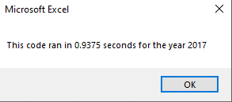
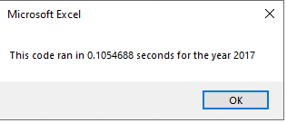
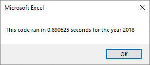
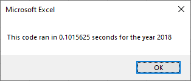

# Stock Analysis Mod2 Challenge
Prepared by Robert Gallagher

## Overview of Project

The purpose of this project was to go through the VBA macro written to create the "All Stocks Analysis" tab  
and refactor the code to improve run times.  The following excel file has both the original macro and the refactored macro
as well as buttons to run both.

[VBA_Challenge.xlsm](VBA_Challenge.xlsm)

## Results

The original macro looped through the data from start to finish once for each of the possible ticker values using nested for loops.
To improve run times we eliminated the nested for loops and stored each unique ticker's data in several arrays to be used to output results
after the loop finished running.

- Original Code
For i = 0 To 11
    ...
    For j = 2 to RowCount
        ...
    Next j
    ...
Next i

- Updated Code
For i = 2 to RowCount
    ...
Next i

As you can see from the code above we only run from 2 to Row count once in the refactored code but would go through it 12 times in the original code.
The following screen grabs demenstrate the improved run times.

- Run time for 2017 Data before refactoring

- Run time for 2017 Data after refactoring

- Run time for 2018 Data before refactoring

- Run time for 2018 Data after refactoring

## Summary

- Advantages and Disadvantages of refactoring
    - Advantages: In general refactoring is used to improve run times and make code easier to read.
    - Disadvantages: Each time you improve code that has already accomplished a task it adds time to a project.  

- Advantages and Disadvantes of the VBA scripts in this project
    - Advantatages:  The refactoring significantly improved the run time between the two scripts
    - Disadvantages: We now have several arrays and if the eventual goal is to run this on a larger data set that includes more tickers there are more parts of the code that will need to be adjusted.

- Next Steps: If the inteded purpose of this refactor is to allow this to run on much larger data sets we would need to change the code so that the various array sizes can be defined by either user inputs or perhaps an input tab in the spreadsheet.  And to allow the tickers array to be filled programatically rather than having them hard coded inside the macro.

